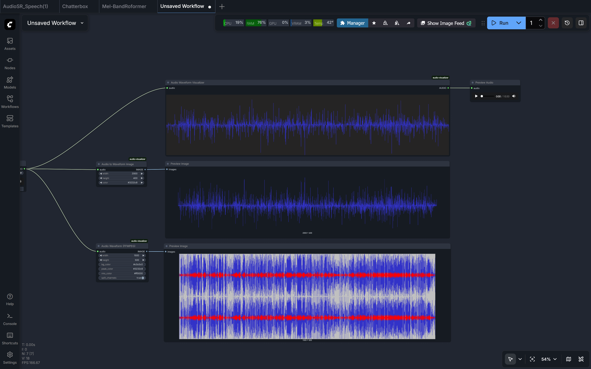

# ComfyUI Audio Waveform Visualizer

A suite of custom nodes for ComfyUI designed to generate high-quality audio waveform visualizations. Whether you need a real-time preview on your node or a high-fidelity image for video synthesis, this package provides multiple ways to see your sound.

## Prerequisites

### System Requirements
* **FFmpeg**: Required for the `Audio Waveform (FFMPEG)` node. 
  * **Windows**: Download from gyan.dev, extract, and add the `bin` folder to your System PATH.
  * **Linux**: `sudo apt install ffmpeg`
  * **macOS**: `brew install ffmpeg`

### Python Dependencies
The nodes rely on several standard libraries. Ensure they are installed in your ComfyUI environment:
```bash
pip install torch numpy matplotlib soundfile Pillow
```

## Preview



## Installation

1. Navigate to your ComfyUI custom nodes directory:
   ```bash
   cd ComfyUI/custom_nodes/
   ```
2. Clone or copy this repository into a folder named `audio-visualizer`.
3. Restart ComfyUI.

---

## Visualization Methods

This custom node provides three ways, each optimized for different use cases.

### 1. Audio Waveform Visualizer (Frontend Canvas)
This node renders a waveform directly on the ComfyUI interface using a JavaScript canvas.

*   **Pros**: Extremely fast; zero impact on generation time; responsive to node resizing; great for quick inspections.
*   **Cons**: Does not produce an image output for other nodes; visualization is lost if the UI is refreshed without re-executing.
*   **Options**:
    *   `audio`: The input audio stream.
*   **Usage**: Best used as a "Preview" node to verify audio content during workflow development.

### 2. Audio to Waveform Image (Matplotlib)
Generates a clean, customizable waveform image using the Matplotlib engine.

*   **Pros**: Supports transparency (RGBA); high-quality vector-like rendering; produces a standard `IMAGE` tensor.
*   **Cons**: Slower than the JS visualizer (though optimized via data decimation).
*   **Options**:
    *   `width/height`: Dimensions of the output image.
    *   `color`: The color of the waveform line (supports hex codes).
*   **Usage**: Ideal for creating overlays or simple assets where you need a transparent background to composite over other images.

### 3. Audio Waveform (FFMPEG) (Recommended)
Uses the professional `showwavespic` filter from FFmpeg to create an "Audacity-style" visualization.

*   **Pros**: Professional look showing both **Peak** and **RMS** levels; excellent stereo handling; very robust.
*   **Cons**: Requires FFmpeg installed on the OS; involves temporary file writing.
*   **Options**:
    *   `bg_color`: The background color of the image.
    *   `peak_color`: The color of the outer "peak" waveform.
    *   `rms_color`: The color of the inner "RMS" (average volume) waveform.
    *   `split_channels`: If `True`, renders Left and Right channels separately (stacked). If `False`, merges them into a single mono view.
*   **Usage**: Best for high-end video production or when you need a detailed, professional-looking waveform.
* Since it uses ffmpeg to generate waveform, the **waveform would be the most accurate in this node**.

---

## Node Details

### Input/Output Types
*   **AUDIO**: Standard ComfyUI audio format.
*   **IMAGE**: Standard ComfyUI image node can be used to preview.

### Notes
*   **Decimation**: The `AudioToWaveformImage` node automatically downsamples audio data before plotting. This prevents Matplotlib from hanging when processing long audio files (e.g., 10+ minutes).
*   **JS Offscreen Buffering**: The frontend visualizer uses an offscreen canvas buffer. It only redraws when the node is resized or new audio is processed, ensuring smooth UI performance.

## 📜 License
MIT