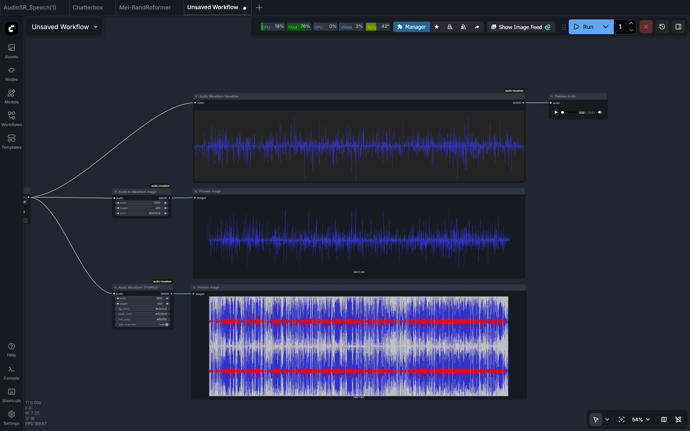

# ComfyUI Audio Waveform Visualizer

A collection of custom nodes for ComfyUI designed to generate audio waveform visualizations. This package provides several methods to visualize audio, ranging from real-time workspace previews to high-resolution images for video synthesis.

---

## Preview



---

## Features

*   **Real-time Visualization**: Waveform rendering directly on the ComfyUI canvas using JavaScript.
*   **Image Generation**: Detailed waveform images using Matplotlib or FFmpeg.
*   **Customization**: Control over dimensions, colors (hex supported), and mono/stereo channel handling.
*   **Performance Optimization**: Audio decimation (downsampling) and offscreen buffering for handling long audio files.

---

## Installation

### 1. Prerequisites

#### **FFmpeg (Required for FFMPEG Node)**
*   **Windows**: Download from [gyan.dev](https://www.gyan.dev/ffmpeg/builds/), extract, and add the `bin` folder to your System PATH.
*   **Linux**: `sudo apt install ffmpeg`
*   **macOS**: `brew install ffmpeg`

#### **Python Dependencies**
Install the required libraries:
```bash
pip install -r requirements.txt
```

### 2. Manual Installation
1.  Navigate to your ComfyUI custom nodes directory:
    ```bash
    cd ComfyUI/custom_nodes/
    ```
2.  Clone this repository:
    ```bash
    git clone https://github.com/kaushiknishchay/ComfyUI-Audio-Waveform-Visualizer audio-visualizer
    ```
3.  Restart ComfyUI.

---

## Visualization Methods

This suite provides three specialized nodes for different use cases.

### 1. Audio Waveform Visualizer (Frontend Canvas)
Renders a waveform directly on the node's UI using a JavaScript canvas.

*   **Usage**: Quick inspection and real-time feedback during workflow development.
*   **Pros**: Fast; minimal impact on generation time; responsive to resizing.
*   **Cons**: No image output; visualization is lost on UI refresh.

### 2. Audio to Waveform Image (Matplotlib)
Generates a waveform image using the Matplotlib engine.

*   **Usage**: Creating clean overlays for composites.
*   **Pros**: Supports transparency (RGBA); generates a standard `IMAGE` tensor.
*   **Parameters**: `width`, `height`, `color` (supports hex codes).

### 3. Audio Waveform (FFMPEG)
Uses the FFmpeg `showwavespic` filter to create a detailed visualization.

*   **Usage**: Video production and accurate audio representation.
*   **Pros**: Displays both Peak and RMS levels; supports stereo channel splitting.
*   **Parameters**: `bg_color`, `peak_color`, `rms_color`, `split_channels` (stereo/mono).

---

## Workflow Examples

An example workflow is available in the `workflows/` directory:
*   **[AudioWaveform.json](./workflows/AudioWaveform.json)**: Demonstrates all three visualization methods.

To use it: Drag and drop the JSON file into your ComfyUI workspace.

---

## Usage Notes

*   **Input**: All nodes accept the standard ComfyUI `AUDIO` type.
*   **Output**: Image-based nodes output a standard `IMAGE` tensor compatible with nodes like `Preview Image` or `Save Image`.
*   **Large Files**: Automatic decimation is applied to manage memory and performance when processing long audio recordings.

---

## License

Distributed under the [MIT License](./LICENSE.md).

---

## Connect

*   **Website**: [nkaushik.in](https://nkaushik.in)
*   **GitHub**: [@kaushiknishchay](https://github.com/kaushiknishchay)
